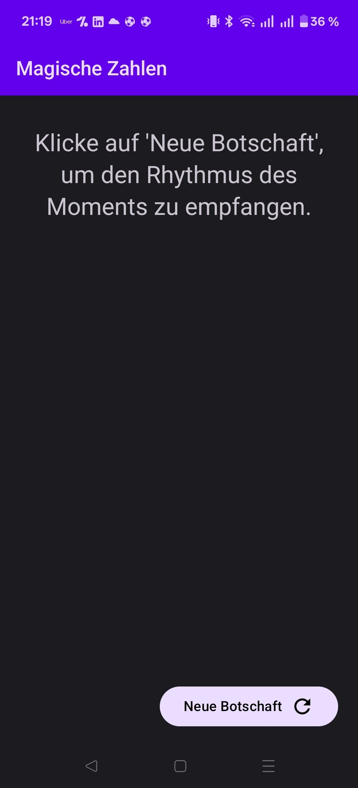
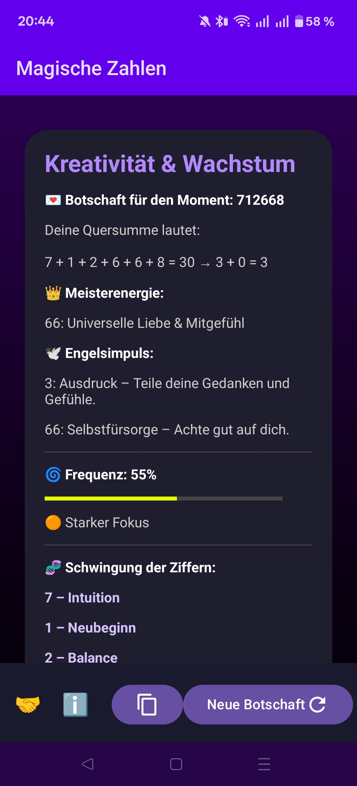

# ✨ Magic Numbers

**Magic Numbers** is an ad-free, offline, and open-source Android app that generates spiritual numerology messages based on the "rhythm of the moment". It combines clean Material 3 design with mystical insights.

## ✨ Features

*   **Rhythm of the Earth Generation**: The numbers are not just random; they are generated based on the exact millisecond of your interaction (`System.currentTimeMillis()`), capturing the unique energy of that specific moment.
*   **Deep Numerology Analysis**:
    *   Calculates the cross sum (digit sum) to find your core message.
    *   Identifies **Master Numbers** (11, 22, 33).
    *   Identifies **Karmic Lessons** based on special number constellations (13, 14, 16, 19, plus new insights for 4, 5, 6, 8).
*   **Vibration Frequency Meter** 🌀: A visual bar indicates the energetic frequency of the generated number – from grounding (red/orange) to high spiritual vibration (green/cyan).
*   **Detailed Interpretations**:
    *   Individual meaning of every digit (0-9).
    *   Special messages for repeating numbers (Angel Numbers like 111, 222).
    *   Energy flow visualization (e.g., Clarity → Trust → Action).
*   **Privacy First**:
    *   100% Offline.
    *   No tracking, no analytics, no ads.
    *   No internet permission required (except for the optional donate link).
*   **User Friendly**:
    *   Modern Material 3 Design (Dark Mode).
    *   Copy functionality for sharing messages.
    *   **Donate Button** 🤝: Support the developer directly via PayPal.

## 🛠 Technical Details

*   **Language**: Kotlin
*   **UI Framework**: Jetpack Compose (Material 3)
*   **Architecture**: Single Activity, State Management via `rememberSaveable` (screen rotation support).
*   **Minimum SDK**: 24 (Android 7.0)
*   **Target SDK**: 35+
*   **License**: MIT License

## 🌍 Localization

The app is fully translated into:
*   🇬🇧 English
*   🇩🇪 German
*   🇨🇿 Czech
*   🇪🇸 Spanish
*   🇫🇷 French
*   🇳🇱 Dutch
*   🇳🇴 Norwegian
*   🇵🇱 Polish
*   🇵🇹 Portuguese
*   🇷🇺 Russian
*   🇸🇪 Swedish
*   🇺🇦 Ukrainian

## 📱 Screenshots

|                   Welcome Screen                   |                    Message View                    |
|:--------------------------------------------------:|:--------------------------------------------------:|
|  |  |

*(To display these images, create an `art` folder in the project's root directory and place your app's icon and screenshots there.)*

## 🛠️ Built With

-   [Kotlin](https://kotlinlang.org/): As the primary programming language.
-   [Jetpack Compose](https://developer.android.com/jetpack/compose): For the declarative and modern UI toolkit.
-   [Material Design 3](https://m3.material.io/): For design components and theming.
-   [Android Studio](https://developer.android.com/studio): As the Integrated Development Environment (IDE).

## 🚀 Getting Started

You can download the app from the Google Play Store (link will be added here once available) or build the project yourself.

### Building from Source

1.  Clone this repository:
2.  Open the project in the latest version of [Android Studio](https://developer.android.com/studio).
3.  Let Gradle sync the project dependencies.
4.  To sign the app for release, you will need to create your own `keystore.properties` file or modify the `signingConfigs` block in the `app/build.gradle` file.
5.  Run the app on an emulator or a physical device.

## 🤝 Contributing

Contributions are welcome!
1.  Fork the project.
2.  Create your feature branch (`git checkout -b feature/AmazingFeature`).
3.  Commit your changes (`git commit -m 'Add some AmazingFeature'`).
4.  Push to the branch (`git push origin feature/AmazingFeature`).
5.  Open a Pull Request.

## 📜 License

This project is licensed under the MIT License - see the [LICENSE](LICENSE) file for details.
