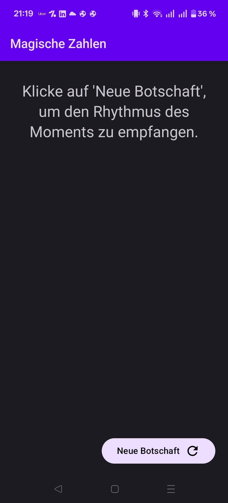
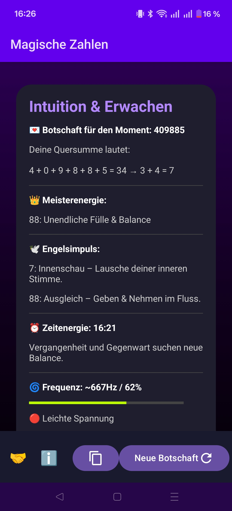

<table>
  <tr>
    <td width="200">
      
    </td>
    <td>      <h1>Magic Numbers</h1>
      <p>Magic Numbers is an ad-free, offline, and open-source Android app that generates spiritual numerology messages based on the **Rhythm of the Moment**.
All calculations are performed locally on the device using a deterministic numerology engine implemented in Kotlin.</p>
<p>You can <strong><a href="https://github.com/Matze1985/MagicNumbers/releases">download the latest release</a></strong> directly from GitHub.</p>
    </td>
  </tr>
</table>

## ✨ Core Functionality (Based on Actual Engine Logic)

---

## 🔢 Rhythm of the Moment – Number Generation

- Numbers are generated on demand.
- The random generator is seeded using:

```kotlin
Random(System.currentTimeMillis())
```

- Default length: **6 digits**
- Leading zeros are preserved.
- Fully deterministic per millisecond of interaction.

---

## 🧮 Cross Sum Calculation

Implemented in:

```kotlin
calculateCrossSum(number: String)
```

### Behavior

1. All digits are summed.
2. If the result is greater than 9:
    - It is reduced step-by-step
    - Reduction stops if:
        - A single digit is reached
        - A master core number (11, 22, 33, 44) appears

Example:

```
0 + 8 + 2 + 0 + 0 + 9 = 19
1 + 9 = 10
1 + 0 = 1
```

The full reduction path is always displayed.

---

## 👑 Master Numbers

### Core Master Numbers

Detected if either:
- Cross sum before reduction matches
- Reduced value matches

Supported core masters:

```
11, 22, 33, 44
```

Core master numbers have highest summary priority.

---

### Amplifier Numbers

Detected by substring presence inside the number:

```
11, 22, 33, 44, 55, 66, 77, 88, 99
```

- Multiple amplifiers supported
- Ordered by appearance in the number
- Do not override core masters

---

## 🕊️ Angel Number Detection

Implemented in:

```kotlin
getAngelResIds(number)
```

### 1️⃣ Run Detection (Adjacent Repetition)

Triggered when at least two identical digits appear consecutively:

Examples:
```
00
11
222
3333
444444
```

- Supports up to 6 repetitions.
- No detection of non-adjacent patterns.
- No false positives.

---

### 2️⃣ Ascending Sequences

Detected dynamically:

```
123
1234
12345
123456
```

Other ascending sequences return a generic ascending message.

---

### 3️⃣ Descending Sequences

Detected dynamically (e.g., 654, 4321).

---

### 4️⃣ Mirror / Palindrome

Detected if:

```kotlin
number == number.reversed()
```

Special handling for 4-digit mirror format (ABBA).

---

### 5️⃣ Alternating Pattern

Detected for 4+ digits:

```
ABAB
1212
3434
```

Exact repetition required.

---

## 🔮 Resonance Pattern Recognition

Applied only for:
- 4-digit numbers
- 6-digit numbers

Implemented in:

```kotlin
getResonance(number)
```

---

### 4-Digit Resonance Patterns

- AAAA (Monotype)
- AABB
- ABAB
- ABBA
- None (fallback)

---

### 6-Digit Resonance Patterns

- AAAAAA (Monotype)
- AAABBB
- ABCABC
- Palindrome
- None (fallback)

Each resonance provides:

- Title
- Meaning
- Focus hint

---

## 🔁 Dominant Repeat Detection

Implemented in:

```kotlin
getDominantRepeatDigit(number)
```

If a digit appears **3 or more times**, it influences:

- Summary
- Energy Flow

---

## 🌀 Frequency Score

Implemented in:

```kotlin
calculateFrequencyScore(number)
```

Formula:

```
average(digits) / 9.0
```

- Clamped between 0.1 and 1.0
- Displayed as percentage
- Visualized with HSV-based color gradient (0–120° hue)

---

## 🎯 State System (Frequency-Based Interpretation)

Implemented in:

```kotlin
getStateResId(frequency: Float)
```

### 📊 Frequency → State Mapping

| Frequency Range | State |
|----------------|------|
| ≥ 0.95 | Pure Clarity |
| ≥ 0.90 | Strong Clarity |
| ≥ 0.85 | Medium Clarity |
| ≥ 0.80 | Weak Clarity |
| ≥ 0.75 | Strong Alignment |
| ≥ 0.70 | Weak Alignment |
| ≥ 0.65 | Strong Tension |
| ≥ 0.60 | Weak Tension |
| ≥ 0.55 | Strong Focus |
| ≥ 0.50 | Weak Focus |
| ≥ 0.45 | Strong Shift |
| ≥ 0.40 | Weak Shift |
| ≥ 0.35 | Strong Transformation |
| ≥ 0.30 | Weak Transformation |
| ≥ 0.20 | Reflection |
| ≥ 0.15 | Open |
| ≥ 0.10 | Withdrawal |
| ≥ 0.05 | Fragile |
| < 0.05 | Void |

---

## ⚡ Pseudo Frequency (Hz Visualization)

Implemented in:

```kotlin
getPseudoHzFormatted(frequency: Float)
```

### Behavior

The app derives a symbolic “frequency resonance” value from the calculated frequency score.

Formula:

```text
Hz = (frequency × 900) + 100
```

### Range

| Frequency Score | Displayed Hz |
|---|---|
| 0.1 | ~190Hz |
| 0.5 | ~550Hz |
| 1.0 | ~1000Hz |

## Harmony & Chakra Interpretation Engine

MagicNumbers analyzes every generated frequency across multiple spiritual layers.

### ☯ Harmony Analysis

The Harmony Engine evaluates the energetic resonance of a number based on its calculated frequency.

- Frequency ≥ 0.5 → Harmony
- Frequency < 0.5 → Learning Field

For the calculated root number and any detected amplifier numbers (11, 22, 33, 44, 55, 66, 77, 88, 99), individual interpretations are dynamically loaded.

Examples:

- **4** → Stability, structure, and grounding
- **7** → Inner wisdom and spiritual growth
- **11** → Intuition and higher awareness
- **22** → Manifestation and master builder energy

Depending on the resonance score, meanings are presented as:

- Harmony
- Learning Opportunity
- Growth Potential

### 🌀 Chakra Mapping

Each frequency is also connected to an energetic center (chakra).

| Number | Chakra |
|----------|---------|
| 1 | Root Chakra |
| 2 | Sacral Chakra |
| 3 | Solar Plexus Chakra |
| 4 | Heart Chakra |
| 5 | Throat Chakra |
| 6 | Third Eye Chakra |
| 7 | Crown Chakra |

Master Numbers have dedicated chakra associations:

| Master Number | Chakra |
|--------------|---------|
| 11 | Third Eye Chakra |
| 22 | Root Chakra |
| 33 | Heart Chakra |
| 44 | Throat Chakra |
| 55 | Solar Plexus Chakra |
| 66 | Sacral Chakra |
| 77 | Crown Chakra |
| 88 | Root Chakra |
| 99 | Crown Chakra |

For every detected frequency, MagicNumbers generates a chakra-specific interpretation, connecting numerological symbolism with energetic awareness.

### 🌌 Multi-Layer Interpretation

Each generated message combines multiple spiritual systems:

- Numerology
- Master Numbers
- Angel Numbers
- Chakra Associations
- Harmony & Learning Fields
- Archetypal Symbolism

This creates a multidimensional interpretation of the generated frequency, transforming a simple number sequence into a meaningful spiritual snapshot of the moment.

### Important Notes

- The Hz value is **symbolic** and not scientifically measured.
- It is intended as a spiritual visualization layer.
- The value is always clamped between:

```kotlin
0.1f – 1.0f
```

- Final output format:

```text
~550Hz
```

---

## 🎨 Visual Frequency Color

The calculated frequency also controls the UI energy color.

Implemented in:

```kotlin
frequencyColor(percent: Float)
```

The hue is mapped dynamically:

```text
Hue = frequency × 120
```

### Color Spectrum

| Frequency | Color |
|---|---|
| Low | Red |
| Medium | Yellow |
| High | Green |

The visualization uses the HSV color model:

```kotlin
Color.hsv(
    hue = hue,
    saturation = 1f,
    value = 1f
)
```

---

## ⏰ Time Energy System

Implemented in:

```kotlin
getTimeEnergyMessage(context, currentTime)
```

### Purpose

The app can attach a spiritual “time resonance message” to the current moment.

The current device time is formatted as:

```kotlin
HH:mm
```

Examples:

```text
22:22
07:07
11:11
03:33
```

The engine converts the current time into a dynamic string resource key:

```kotlin
time_2222
time_1111
time_0707
```

and attempts to load a localized message from Android resources.

---

## 🔍 Dynamic Resource Resolution

Implemented using:

```kotlin
context.resources.getIdentifier(...)
```

### Example

```kotlin
val normalized = currentTime.replace(":", "").trim()
val resName = "time_$normalized"
```

If the matching string resource exists:

```xml
<string name="time_1111">
A gateway of alignment is opening around you.
</string>
```

the message is displayed automatically.

---

## 📌 Behavior

- Fully offline
- Based on device local time
- Optional system
- No internet requests
- Fully localized through Android string resources
- Missing entries safely return:

```kotlin
null
```

---

# 🌌 Battery Energy Concept

The battery is interpreted as a symbolic spiritual frequency state.

Examples:

| Battery | Meaning |
|---|---|
| 11% | Intuition becomes stronger |
| 22% | Manifestation energy rises |
| 44% | Protection surrounds you |
| 77% | Mystical resonance appears |
| 88% | Infinite energy awakens |
| 100% | Universal alignment achieved |

---

```text
🔋 Battery Energy 66%
Heart energy shines brightly.
```

---

## 🧾 Time Energy Display Logic

If a valid time message exists:

- The current time is shown
- The resonance text is displayed
- The section becomes part of:
    - UI output
    - Clipboard export

Example:

```text
Time Energy: 22:22
Alignment between intention and manifestation is strongest now.
```
---

## 🌍 Localization Support

Time energy messages support all translated languages automatically via:

```text
res/values-xx/strings_time.xml
```

This allows culturally adapted interpretations for symbolic times such as:

- 11:11
- 22:22
- 03:33
- 07:07
- 12:12
- etc.

---

## 🔥 Energy Flow

Implemented in:

```kotlin
getEnergyFlowResId(...)
```

Priority order:

1. Master Core
2. Dominant repeated digit
3. Reduced cross sum

Exactly one energy flow message is shown.

---

## 🧬 Karmic Detail

Based on:

```
sumBeforeReduce
```

Supported values:

```
1 – 33
```

Includes traditional karmic numbers:
10, 13, 14, 16, 19, etc.

---

## 🧠 Summary Prioritization Logic

Implemented in:

```kotlin
getSummaryResId(...)
```

Priority:

1. Master Core
2. Multiple Amplifiers
3. Dominant repeat (≥3)
4. Reduced cross sum

Angel numbers and resonance never override each other.

---

## 📋 Copy Output Structure

The generated clipboard text includes:

- Title
- Message for the moment
- Cross sum steps
- Master energy section
- Angel section
- Harmony & Chakra Interpretation Engine
- Frequency %
- Digit vibration (unique digits only)
- Digit descriptions (with amplification text)
- Resonance section
- Summary
- Karmic detail (if applicable)
- Energy flow

Markdown formatting is cleaned before export.

---

## 🛠 Technical Details

- Language: Kotlin
- UI Framework: Jetpack Compose (Material 3)
- Architecture: Single Activity
- State Management: rememberSaveable
- Minimum SDK: 24 (Android 7.0)
- Target SDK: 35+
- License: MIT

No ads.  
No tracking.  
No analytics.  
No internet required.

## 🌍 Localization

The app is fully translated into:

*   🇸🇦 Arabic (العربية)
*   🇧🇬 Bulgarian (Български)
*   🇨🇳 Chinese Simplified (简体中文)
*   🇭🇷 Croatian (Hrvatski)
*   🇨🇿 Czech (Čeština)
*   🇩🇰 Danish (Dansk)
*   🇳🇱 Dutch (Nederlands)
*   🇬🇧 English (UK)
*   🇺🇸 English (US)
*   🇪🇪 Estonian (Eesti)
*   🇫🇮 Finnish (Suomi)
*   🇫🇷 French (Français)
*   🇩🇪 German (Deutsch)
*   🇬🇷 Greek (Ελληνικά)
*   🇮🇱 Hebrew (עברית)
*   🇮🇳 Hindi (हिन्दी)
*   🇭🇺 Hungarian (Magyar)
*   🇮🇩 Indonesian (Bahasa Indonesia)
*   🇮🇹 Italian (Italiano)
*   🇯🇵 Japanese (日本語)
*   🇰🇷 Korean (한국어)
*   🇱🇻 Latvian (Latviešu)
*   🇱🇹 Lithuanian (Lietuvių)
*   🇳🇴 Norwegian (Norsk)
*   🇵🇱 Polish (Polski)
*   🇵🇹 Portuguese (Português)
*   🇷🇴 Romanian (Română)
*   🇷🇺 Russian (Русский)
*   🇷🇸 Serbian (Српски)
*   🇸🇰 Slovak (Slovenčina)
*   🇸🇮 Slovenian (Slovenščina)
*   🇪🇸 Spanish (Español)
*   🇸🇪 Swedish (Svenska)
*   🇹🇭 Thai (ไทย)
*   🇹🇷 Turkish (Türkçe)
*   🇺🇦 Ukrainian (Українська)
*   🇻🇳 Vietnamese (Tiếng Việt)

## 📱 Screenshots

|                   Welcome Screen                   |                    Message View                    |
|:--------------------------------------------------:|:--------------------------------------------------:|
|  |  |

*(To display these images, create an `art` folder in the project's root directory and place your app's icon and screenshots there.)*

## 🛠️ Built With

-   [Kotlin](https://kotlinlang.org/): As the primary programming language.
-   [Jetpack Compose](https://developer.android.com/jetpack/compose): For the declarative and modern UI toolkit.
-   [Material Design 3](https://m3.material.io/): For design components and theming.
-   [Android Studio](https://developer.android.com/studio): As the Integrated Development Environment (IDE).

## 🚀 Getting Started

You can download the app from the Google Play Store (link will be added here once available) or build the project yourself.

### Building from Source

1.  Clone this repository:
2.  Open the project in the latest version of [Android Studio](https://developer.android.com/studio).
3.  Let Gradle sync the project dependencies.
4.  To sign the app for release, you will need to create your own `keystore.properties` file or modify the `signingConfigs` block in the `app/build.gradle` file.
5.  Run the app on an emulator or a physical device.

## 🤝 Contributing

Contributions are welcome!
1.  Fork the project.
2.  Create your feature branch (`git checkout -b feature/AmazingFeature`).
3.  Commit your changes (`git commit -m 'Add some AmazingFeature'`).
4.  Push to the branch (`git push origin feature/AmazingFeature`).
5.  Open a Pull Request.

## 📜 License

This project is licensed under the MIT License - see the [LICENSE](LICENSE) file for details.